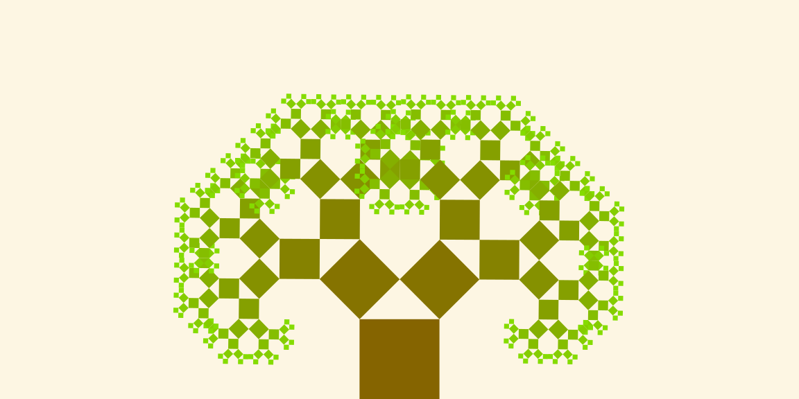

# Garden
A to be collection of trees.
List of possible interesting trees to plant:
* Data visualization trees
  * ~~Traditional Pythagoras tree~~
  * Generalized Pythagoras tree
* Data structures
  * Binary trees
    * Traditional binary tree
    * Red-black tree
      * Traditional
      * Augmented
    * AVL trees
  * Space paritioning trees
    * K-d tree
    * Quad-tree
  * Heap
  * Trie
* Minimum spanning trees
  * Prim's algorithm
  * Kruskal's algorithm
* Digital trees
 * Fractal tree
 * Space colonization tree
 * L-system tree
  
## Traditional Pythagoras tree

